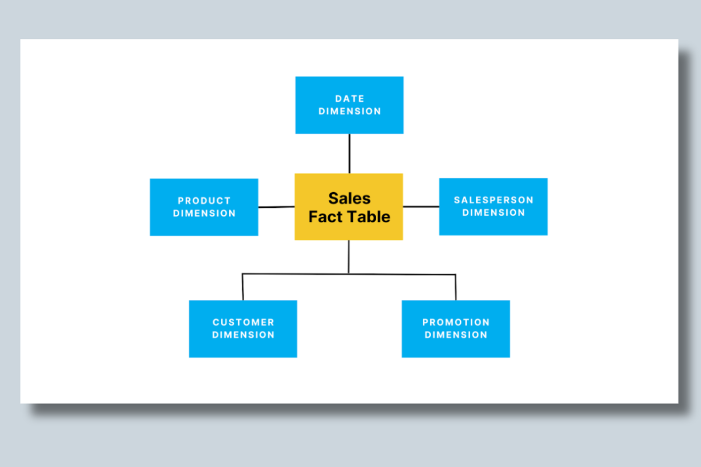
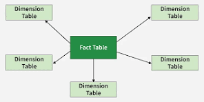
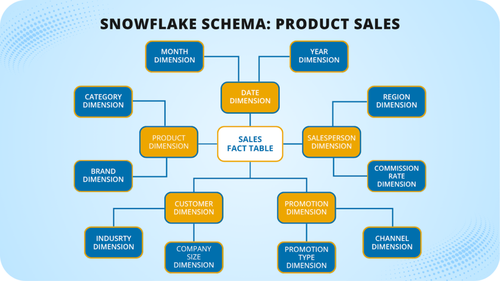

# Data Modeling 
## Definition
   - Data modeling is the process creating blueprint of how data is stored ,connected ,retrived in the system 
## why we need data modeling
   - it makes easier to understand data and use it 
   - improves query performance
   - helps builds scalable system 
** As a data engineer it is a duty to design data model that  should support reports,scalablity and performance ** 
# OLTP(online Transactional processing)
   - running day to day transaction insert ,update,deleting in real time 
   - multiple writes in a day
   - data is normalized 3NF 
   - querys are small,but lot of joins
   - **example**
      banks transforming money
      in e-commerce application ordering items
# OLAP(online analytical processing)
   - Data is Denormalinzed for avoid to many joins for reduce computing cost
   - reading the table is most common use case ,writes are minimal 
   - ** example ** 
      - gold layer data
      - many fact table + dimentional tables
   - huge complex queries
# Fact table 
   - Fact tables stores numeric values,keys.
   ** example **
     - orders table like cust_id,prod_id,order_id,price,quantity,date
# Dimenstional table
   - Dimenstional table stores descriptive text and labels      
   ** example ** 
     - customer_detail table like cust_name,surrogate_cust_k,address,email,cust_id
     - product_details table like product_id,surrogate_prod_k,prod_name,varient,price.

# Why we split tables 
  ## To Save storage space
   - if we combine all table into one table there will we lot of duplicates
  ## Makes update easier
     - if price is changed we just need to update products tables only not customer details as well
  ## keeps data clear
     - it make data easier to understand
  ## Query faster
     - fact table are numeric ,dimentional descriptive ,keep them seperate makes query faster

# example image

# Star Schema 
  - In the Star Schema fact table are directly connected to denormalized dimentional tables
# Snow Flake Schema 
  - In the Snow flake Schema same idea but dimentional table further normalized into sub-dimentions  

  ** example ** 
   - in the star schema all columns in one table like product_name,product_id,category,subcategory at one place
   - in snowflake schema subcategory  and category would be splited into dim_category,dim_products  with foreign key
  ## Trade off 
    - in Star schema data is denormalized so query works faster,but there is reduandcy  of data
    - in snow flake schema data are normalized,avoids reduandcy of data ,but for query we need do lot of joins,so its decreases query performance
   ## Star Schema example 

         

   ## Snow flake example 
        
       