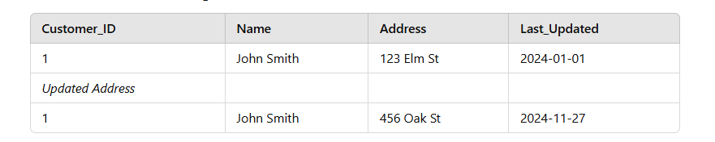
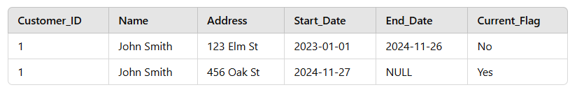
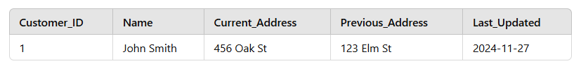

# Scd (Slowly Changing Dimensions)
# Scd type 1
 - just old value replaced by new value
 - no history of changes
 ** example ** 
 - when customer changes address ,it will be over written
   
# Scd type 2
  - each updates creates new row
  - all history stored
  - needs lot of storage space
  ** example **
  
# Scd type 3
  - keeps minimal history
  - it adds previos column and current column for store both value
  ** example **
  